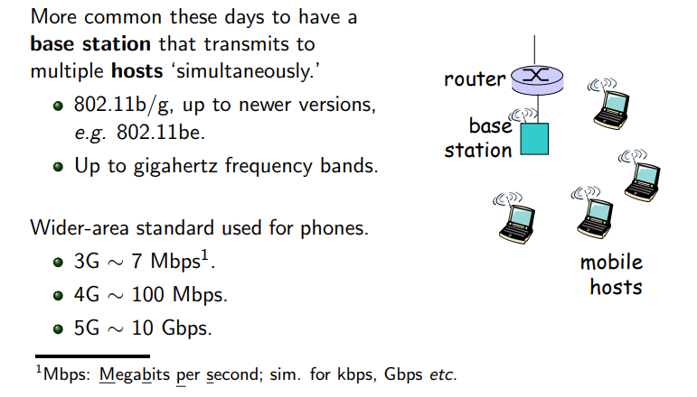

# Networks

**Three** main topics

- Network programming
- Network architecture
- Network infrastructure

## 0. History of Network

| Name | Time | Institute | Discreption |
|------|------|-----------|-------------|
| **ARPA**net | 1969 | MIT | The **first** computer network; Used a **packet switch**, similar to phone networks |
| **Internet** (Interconnecting networks) | 1974 | Cerf and Kahn | a **network of networks**; development of **protocols**, including an early version of **TCP** |
| **WWW** (World Wide Web) | 1990's | Tim Berners-Lee at CERN | Involved HTML, HTTP, a Web server and a browser |

- Early browser: **Mosaic**, **Netscape**
- Netscape lost out to **Microsoft Explorer**, Microsoft Explorer lost out to **Chrome**, **Edge**.
- A colleague of Tim Berners-Lee, Robert Cailliau, helped UoL develop a **Campus Wide Informetion Service** (**CWIS**)
- UoL was the **first** institute in the **UK** to have an officially sanctioned WWW presence.

### More Modern Networks

- **Hosts** or **end systems**: laptops, devices, serves etc.
- **Edge routers** or the **access network**: the last node before the end systems

### Early Residential Access

### Wi-Fi

## 1. Network Programming

- TCP
- UDP
- DNS
- DHCP
- SMTP
- POP3

| Tcp | UDP | DNS | DHCP | SMTP | POP3 |
|-----|-----|-----|------|------|------|
|Transmission Control Protocol|User Datagram Protocol|Domain Name System|Dynamic Host Configuration Protocol|Simple Mail Transfer Protocol|Post Office Protocol 3|
|传输控制协议|用户数据报协议|域名系统|动态主机设置协议|简单邮件传输协议|邮局协议的第3个版本|
|传输层协议|传输层协议|应用层协议|应用层协议|应用层协议|应用层协议|
|提供**可靠的**、**面向连接**的数据传输|提供**不可靠的**、**无连接的**数据传输|把域名解析为IP地址， 如：www.google.com→142.250.190.36|为设备自动分配地址和网络配置信息|发送电子邮件（主要用于发送方服务器）|接收电子邮件（从邮件服务器下载到客户端）|
|TCP和UDP是运输员，前者**稳定但慢**|后者**快但不负责**|DNS是网络电话簿，把名字变成数字地址|DHCP是自动分布地址的“接待员”|SMTP把邮件**寄出去**|POP3把邮件**h拿回来**|

## 2. Network Architecture

### 2.1. Network Type

- LAN

- MAN
- WAN

| Type | Name | Full Name | Cover | Example | Characteristic |
|------|------|-----------|-------|---------|----------------|
| LAN | 局域网 | Loacal Area Network | 小范围（几米到几公里）| 家庭、办公室、校园 | 快速、成本低、管理简单 |
| MAN | 城域网 | Metropolitan Area Network | 中等范围（城市范围内）| 城市光纤网络、地铁Wi-Fi系统| 连接多个LAN，城市级服务 |
| WAN | 广域网 | Wide Area Network | 大范围（跨城市、国家、全球）| 互联网、企业跨国网络 | 通常使用公共路线（如卫星/光缆），速度较慢、成本高 |

### 2.2. Network Model

**OSI Model** (Open Systems Interconnection Model)

| Layers | Name | Main Function |
|--------|------|---------------|
| 7      | Application (应用层) | 用户接口、电子邮件、网页等（如HTTP, SMTP）|
| 6      | Presentation (表示层) | 数据格式转换、加解密 |
| 5      | Session (会话层) | 建立/管理会话（如登录会话）|
| 4      | Transport (传输层) | 可靠性、流量控制（如TCP、UDP）|
| 3      | Network (网络层) | 路由、IP地址（如IP协议）|
| 2      | Link (数据链路层) | 数据帧处理、MAC地址（如Ethernet）|
| 1      | Physical (物理层) | 电缆、无线信号等物理传输媒介 |

- Applications **send** data **down** through the stack
- Applications **receive** data **up** through the stack

### 2.3. Conclusion

- LAN/MAN/WAN 是**网络在哪里**的分类，按物理范围划分；
- OSI 是**数据怎么走**的分层模型，按通信过程划分

| 比较维度 | Networ Type | OSI Model |
|---------|-------------|-----------|
| 本质     | 网络**分类标准** | 网络**通信结构模型** |
| 关注点   | 网络的**范围/物理布局** | 数据**如何流经系统** |
| 用途     | 描述实际网络拓扑和规模 | 标准化设备/系统间通信 |
| 联系     | LAN、MAN、WAN的通信都**遵循OSI Model的分层原理 | |

## 3. Network Infrastructure

- Ethernet
- 802.11a/b/g/n
- network devices (switches, routers and access points)

## 4. Exams

- [2021](exams/2021.pdf)
- [2022](exams/2022.pdf)
- [2023](exams/2023.pdf)
- [2024](exams/2024.pdf)
  
## 5. Slides

- [slides-1](slides/slides-1.pdf)
- [slides-2](slides/slides-2.pdf)
- [slides-3](slides/slides-3.pdf)
- [slides-4](slides/slides-4.pdf)
- [slides-5](slides/slides-5.pdf)
- [slides-6](slides/slides-6.pdf)
- [slides-7](slides/slides-7.pdf)
- [slides-8](slides/slides-8.pdf)
- [slides-9](slides/slides-9.pdf)
- [slides-10](slides/slides-10.pdf)
- [slides-11](slides/slides-11.pdf)
- [slides-12](slides/slides-12.pdf)
- [slides-13](slides/slides-13.pdf)
- [slides-14](slides/slides-14.pdf)
- [slides-15](slides/slides-15.pdf)
- [slides-16](slides/slides-16.pdf)
- [slides-17](slides/slides-17.pdf)
- [slides-18](slides/slides-18.pdf)
- [slides-19](slides/slides-19.pdf)
- [slides-20](slides/slides-20.pdf)
